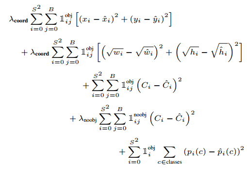

# YOLOv3 Implementation using Tensorflow

We implemented the YOLO architecture using the Tensorflow framework.

## Preprocessing

Of the training datasets x and y, x is an image and y is a label in the following format.

    [class] [x] [y] [w] [h]

[class] is the class number for classification. x, y, w, h are coordinate information of a specific object in the image. x and y denote the center of the object, w and h denote the width and height of the object, and these 4 values ​​are normalized to 0~1 based on the total size of the image pixel.

YOLO divides the image into a grid of S by S. In actual training, we multiply these four values ​​of the label by the grid size S so that the neural network can regress a larger number.

## Loss Function

The loss function for training the model is:



## Requirements

- Tensorflow 2.3.0
- OpenCV-Python

## Usage

First, define a function that creates and returns a model. However, it must be a function with the following parameters.

```python
import tensorflow as tf

from losses import yolo_loss

def yolo_model(
        num_classes: int,
        kernel_initializer: str = "he_normal",
        learning_rate: float = 1e-3,
        bn_momentum: float = .9,
        lrelu_alpha: float = .1):
    input_layer = tf.keras.layers.Input(shape=(...))
    x = tf.keras.layers.Conv2D(...)(input_layer)
    ...
    
    model = tf.keras.models.Model(input_layer, x)
    model.compile(
        optimizer=tf.optimizers.Adam(learning_rate=learning_rate),
        loss=yolo_loss)
    
    return model
```

Second, just call the train function from the utils package. In some cases, if you want to see live view, use the on_batch_end function of the utils package.

```python
from utils import train
from [my_package].model import yolo_model

if __name__ == '__main__':
    train(
        paths=paths,        # List of dataset paths
        model_function=yolo_model,
        target_width=target_width,
        target_height=target_height,
        grid_width_ratio=grid_width_ratio,
        grid_height_ratio=grid_height_ratio,
        anchors=anchors,    # 2D List, [[w, h]]
        epochs=epochs,
        batch_size=batch_size)
```